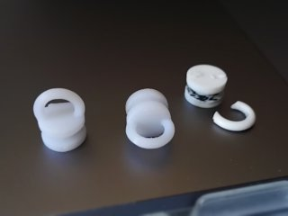
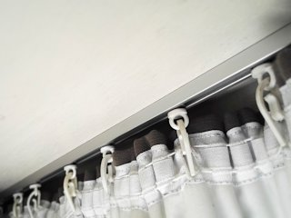
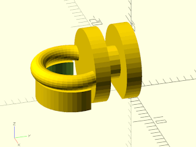

# Customizable curtain rail slider
*3D printable parametric curtain rail slider / glider*

### License
[Creative Commons - Attribution](https://creativecommons.org/licenses/by/4.0/)

### Gallery

[🔎](images/slider1.jpg) [🔎](images/slider2.jpg) [🔎](images/scad-preview.png)

## Description and Instructions

This is a simple curtain rail slider for the typical curtain rails with a ‘U’ shape (aluminium or plastic). These things are prone to breaking when abused, and finding replacements of the right size may be a hassle. With this OpenSCAD model, you can generate easy-to-print replacements of any dimensions. Of course it will be much more economical to buy these in bulk if you need large quantities, but if you only need a few spares, printing them makes a lot of sense.

The example STL files might be all you need, they match one particular type of rail used at our home (amidst probably 5 other types, why does every curtain here use a unique type of rail…)

If you need another size of this same design, accurately measure it with a calliper (or use trial-and-error) and [use OpenSCAD's Customizer](https://www.dr-lex.be/3d-printing/customizer.html) to generate the model.

The ‘easyPrint’ STL file was generated with a built-in support and part of the side cut off, and I recommend keeping those options enabled when generating your own models. This makes them ready-to-print without any hassles (I wouldn't trust auto-generated supports for parts this small). If you insist on having perfectly round gliders, you can print the whole model (disable the `chop` option) with added supports, but this is pretty pointless unless you fear visitors might inspect your curtains and complain about the less-than-perfect roundness of the gliders.

It is important to print the model in the orientation as provided in the STL file. This ensures that strength is maximal where it is needed. With the right materials and print settings, 3D printed versions of these sliders might exceed the strength of injection-moulded parts.

The best material to print this in, is probably nylon, but PETG also works very well due to its good strength and low friction. Avoid PLA and ABS as they risk becoming brittle over time, especially when exposed to sunlight.

### Print settings

I print these in PETG at 0.15 mm layers. Use 3 perimeters to maximise strength. The remaining gaps can be filled with 100% infill although the strength should be mostly in the perimeters.

## Tags
`customizable`, `openscad`, `curtain`, `rail`, `slider`, `glider`, `hook`
